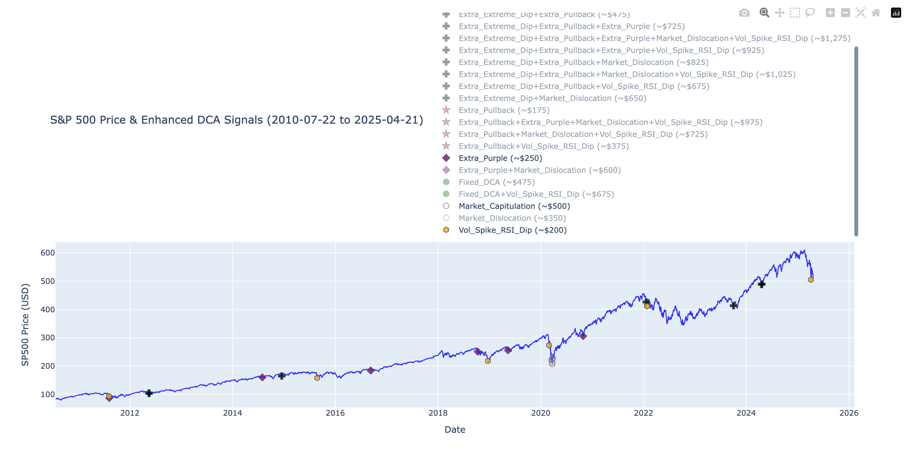
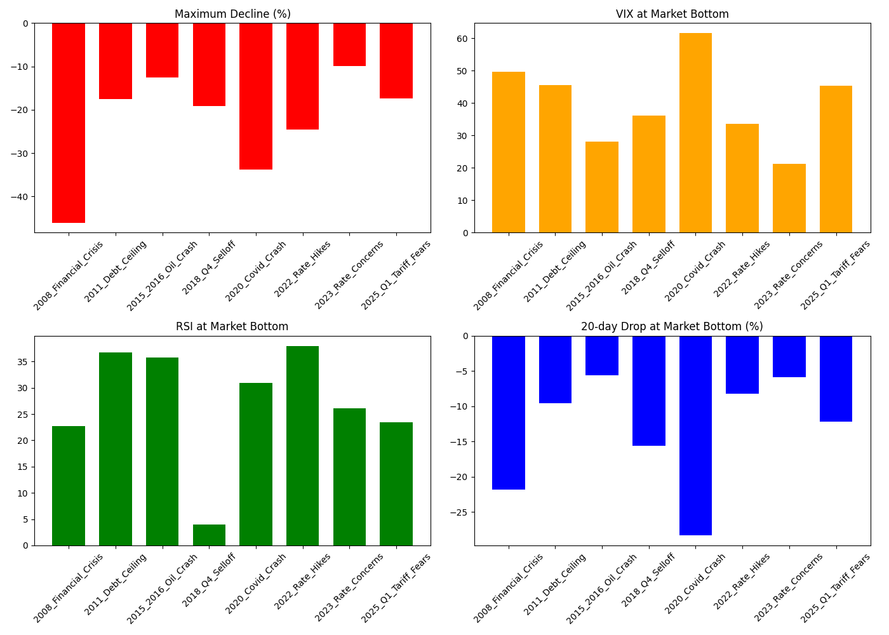
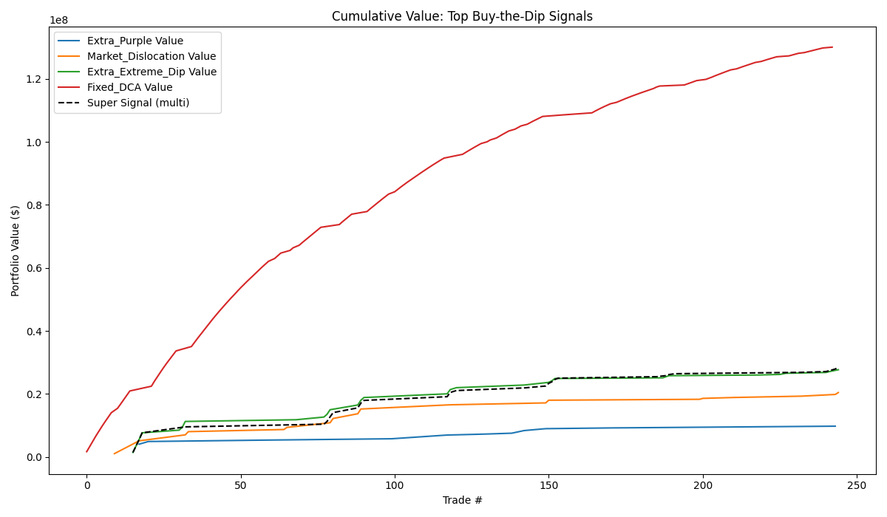
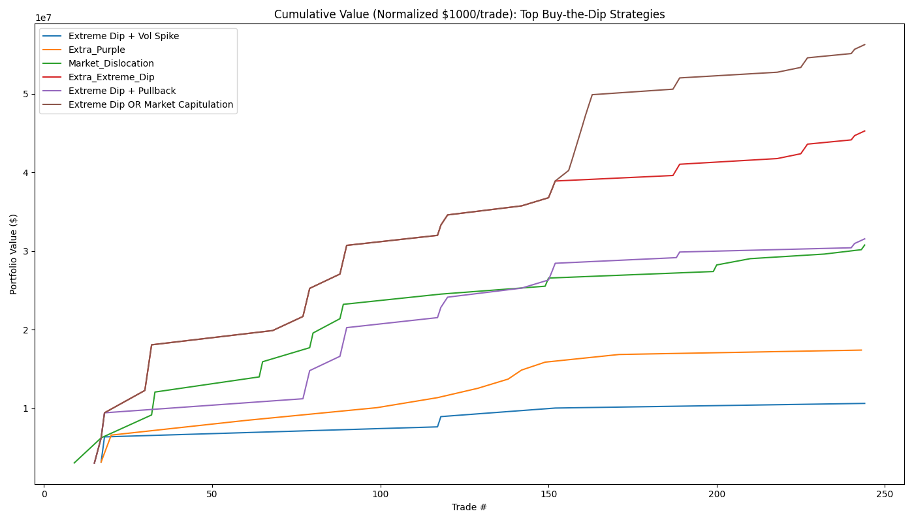
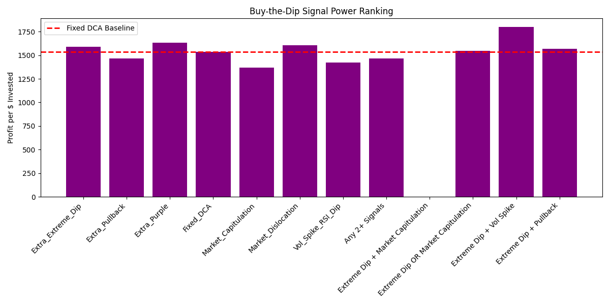

# 📈 Enhanced DCA Strategy Simulator for S&P 500

This repository provides a robust Python-based backtesting framework for simulating an **Enhanced Dollar-Cost Averaging (DCA)** strategy on the **S&P 500 (SPY)** ETF. The strategy intelligently adds capital during dip-buying opportunities, using technical indicators like **RSI**, **MACD**, **pullbacks**, and **black swan detection**.

---

## 🔍 Features

- 💰 **Fixed Monthly DCA** — invests a constant amount on a specified day each month.
- 📉 **Dynamic Dip Buying**:
  - Oversold RSI triggers
  - Pullbacks from recent highs
  - Extreme drawdowns ("Black Swan" events)
  - MACD-based confirmation
- 📊 **Buy & Hold Comparison** (optional)
- 📈 **Visualizations**:
  - Investment signals plotted on SPY price chart
  - RSI evolution
- 🧮 **Performance Metrics**:
  - ROI, CAGR, Sharpe/Sortino, Max Drawdown, Calmar Ratio, Alpha/Beta

---

## 🧠 Strategy Overview

This enhanced strategy extends basic DCA by adding extra investment under specific market conditions:

| Signal Type         | Trigger Condition                                    | Investment Amount |
|---------------------|------------------------------------------------------|--------------------|
| Fixed DCA           | 1st of each month                                     | $475               |
| Extra Normal        | Uptrend + RSI < 30                                    | $100               |
| Extra Purple Alert  | Extreme negative returns + RSI < 30 (Black Swan)      | $200               |
| Extra Pullback      | Price drops > 5% from 10-day high + RSI < 30          | $150               |
| Extra Extreme Dip   | RSI < 25 (extreme oversold)                           | $250               |

---

## 🚦 Investment Signals

| Signal Name           | Trigger Condition                                             | Default Amount |
|-----------------------|--------------------------------------------------------------|---------------|
| **Fixed DCA**         | 1st of each month                                            | $475          |
| **Extra Normal**      | Uptrend detected and RSI < 30                                | $100          |
| **Extra Purple Alert**| Extreme negative returns and RSI < 30 (Black Swan event)     | $200          |
| **Extra Pullback**    | Price drops > 5% from 10-day high and RSI < 30               | $150          |
| **Extra Extreme Dip** | RSI < 25 (extreme oversold)                                  | $250          |

Each signal can be enabled or disabled via the `CONFIG` dictionary at the top of the script.

---

## 🛠️ Installation

### 1. Clone the repository
```bash
git clone https://github.com/ESJavadex/black-swam-detector.git
cd black-swam-detector
```

### 2. Install dependencies
```bash
pip install -r requirements.txt
```

### 3. Run (Native)
```bash
python3 main.py
```

---

## 🐳 Running with Docker & Docker Compose

You can run the simulation in a containerized environment using Docker or Docker Compose.

### 1. Build the Docker image
```bash
docker build -t black-swam-detector .
```

### 2. Run with Docker
```bash
docker run --rm -it black-swam-detector
```

### 3. Run with Docker Compose
```bash
docker-compose up --build
```

- The container exposes port 5002 to all hosts (`0.0.0.0:5002`).
- **Note:** The script is a CLI tool and does not start a web server, but port 5002 is exposed for compatibility and future extensions.
- To pass arguments (e.g., a simulation date), modify the `command` in `docker-compose.yml` or append them to the `docker run` command.

---

## 📂 Output

- 📈 **Interactive Plots** (via Plotly)
- 📁 `enhanced_dca_transactions.csv` — detailed list of all investment transactions (date, amount, signal type, etc.)
- 📁 `performance_summary.csv` — side-by-side comparison of strategy-level performance metrics
- 📁 `signal_stats_summary.csv` — summary statistics for each investment signal (frequency, profitability, etc.)

---

## 📊 Example Visualizations


*SP500 price with investment signals.*


*Comparison of market corrections and strategy responses.*


*Cumulative value of the strategy over time.*


*Normalized cumulative value for easier comparison.*


*Profit per dollar invested by signal type.*

> These plots provide insight into strategy performance, signal effectiveness, and market correction handling.

---

## 📋 Specifications

### CSV Output Formats

- **enhanced_dca_transactions.csv**
  - Columns: `Date`, `Signal_Type`, `Amount`, `Price`, `Shares`, `Cumulative_Investment`, `Cumulative_Shares`, `Portfolio_Value`, ...
  - Each row records an investment triggered by a specific signal, with running totals.

- **performance_summary.csv**
  - Columns: `Strategy`, `Total_Return`, `CAGR`, `Sharpe_Ratio`, `Sortino_Ratio`, `Max_Drawdown`, `Calmar_Ratio`, `Alpha`, `Beta`, ...
  - Summarizes key metrics for each strategy or signal.

- **signal_stats_summary.csv**
  - Columns: `Signal_Type`, `Num_Trades`, `Total_Invested`, `Total_Value`, `Profit_Per_Dollar`, `Win_Rate`, ...
  - Aggregates statistics for each signal type.

### Image/Plot Outputs

- **market_corrections_comparison.png**: Bar/line chart comparing major market corrections and strategy responses.
- **signal_cumulative_value.png**: Cumulative value of the portfolio over time, by signal.
- **signal_cumulative_value_normalized.png**: Same as above, but normalized to initial value for comparison.
- **signal_profit_per_dollar.png**: Bar chart of profit per dollar invested, per signal type.

### Investment Signal Logic

- **Fixed DCA**: Invests a fixed amount on the 1st of each month.
- **Extra Normal**: Invests when uptrend is detected and RSI < 30.
- **Extra Purple Alert**: Invests when extreme negative returns occur and RSI < 30 (Black Swan event).
- **Extra Pullback**: Invests when price drops > 5% from 10-day high and RSI < 30.
- **Extra Extreme Dip**: Invests when RSI < 25.

See the `CONFIG` dictionary for enabling/disabling each signal.

---

## 📄 Configuration

Configuration flags are set at the top of the script:

```python
CONFIG = {
    'fixed_dca': True,
    'extra_normal': True,
    'extra_purple_alert': True,
    'extra_pullback': True,
    'extra_extreme_dip': True,
    'buy_and_hold': False,
}
```

You can toggle components on/off to compare strategies.

---

## 📌 Notes & Best Practices

- **Data Source**: Yahoo Finance via `yfinance`
- **Indicators**: RSI, MACD, SMA, volatility, returns
- **Backtest Range**: 2015–present (default)
- **Output Format**: Daily portfolio evolution with cumulative investment, share count, and value.

---

## ⚠️ Disclaimer

This script is for **educational and informational purposes only**.  
It does **not constitute financial advice**.  
Trading and investing carry significant risk.  
Use a **demo account** and consult a **financial advisor** before making decisions.

---

## 📜 License

MIT License. Feel free to use, modify, and share with attribution.